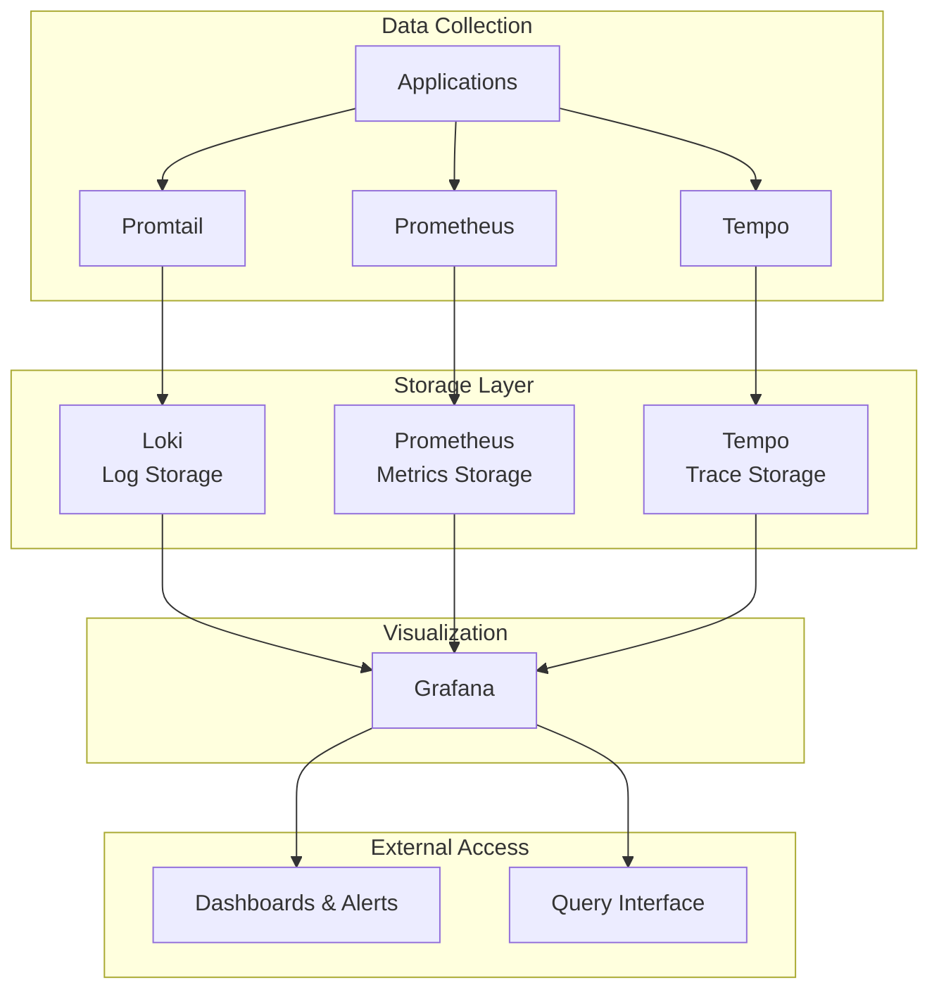

# Grafana Observability Stack

A comprehensive, production-ready observability platform implementing the **three pillars of observability**: metrics, logs, and traces. Built with Docker Compose for easy deployment and management.

## 🎯 Overview

This project offers a full-stack monitoring and observability solution using industry-standard tools from the Grafana ecosystem. It enables visibility into your applications and infrastructure via unified data collection, storage, and visualization.

### Features at a Glance

- **📊 Metrics Collection**: Scrapes and stores time-series metrics using Prometheus  
- **📝 Log Aggregation**: Collects, processes, and stores logs via Loki and Promtail  
- **🔍 Distributed Tracing**: Captures and analyzes request traces with Tempo  
- **📈 Unified Visualization**: Correlated dashboards and alerts via Grafana  
- **🔗 Data Correlation**: Links metrics, logs, and traces for end-to-end debugging  

### Key Benefits

- ✅ **Production-Ready**: Persistent storage, automatic restarts, and robust networking  
- ✅ **Zero-Config Setup**: Pre-configured data sources and dashboards  
- ✅ **Correlation-Enabled**: Trace-to-log linking and cross-source queries  
- ✅ **Scalable Architecture**: Container-based with volume persistence  
- ✅ **Environment Flexible**: Ports and credentials configurable via `.env`  

## 🏗️ Architecture



### Component Responsibilities

| Component     | Purpose                         | Data Type                   | Port        |
|---------------|----------------------------------|-----------------------------|-------------|
| **Prometheus**| Metrics scraping and storage     | Time-series metrics         | 9090        |
| **Grafana**   | Visualization and dashboards     | All data types              | 3000        |
| **Loki**      | Log aggregation and storage      | Structured/unstructured logs| 3100        |
| **Promtail**  | Log collection agent             | Log shipping                | 9080        |
| **Tempo**     | Distributed tracing backend      | Request traces              | 3200 / 9095 |

**Note**: Loki, Tempo, and Promtail expose internal metrics to Prometheus for self-monitoring.

## 🚀 Quick Start

### Prerequisites

- **Docker** (v20.10+)
- **Docker Compose** (v2.0+)
- **4GB+ RAM** available
- **Ports available**: 3000, 3100, 3200, 9090, 9095

### 1. Clone and Setup

```bash
git clone https://github.com/Deffz-Finesse/Grafana-Observability-Stack.git
cd Grafana-Observability-Stack

# Create required directories
mkdir -p logs
```

### 2. Environment Variables

Edit the included `.env` file:

```bash
# ─── Grafana
GRAFANA_USER=admin
GRAFANA_PASSWORD=secret
GRAFANA_PORT=3000

# ─── Prometheus
PROMETHEUS_PORT=9090

# ─── Loki
LOKI_PORT=3100

# ─── Tempo
TEMPO_HTTP_PORT=3200
TEMPO_GRPC_PORT=9095
```

### 3. Launch the Stack

```bash
docker-compose up -d       # Start all services
docker-compose ps          # Verify containers
docker-compose logs -f     # View logs if needed
```

### 4. Access the Services

| Service      | URL                                              | Credentials     |
|--------------|---------------------------------------------------|-----------------|
| **Grafana**  | [http://localhost:3000](http://localhost:3000)    | admin / secret  |
| **Prometheus**| [http://localhost:9090](http://localhost:9090)   | None            |

## 📊 Usage Guide

### Accessing Grafana

1. Visit [http://localhost:3000](http://localhost:3000)
2. Login using configured credentials
3. Use pre-configured data sources:
   - Prometheus (metrics)
   - Loki (logs)
   - Tempo (traces)

### Viewing Metrics

```promql
# Example Prometheus queries
up                                  # Service health
rate(http_requests_total[5m])       # Request rate
prometheus_tsdb_head_series         # Metric count
```

### Querying Logs

```logql
{container="app"}                    # Logs from app container
{level="error"}                      # Error-level logs
{service="api"} |= "timeout"         # API logs containing "timeout"
```

### Exploring Traces

1. Open **Explore** in Grafana  
2. Select **Tempo** as data source  
3. Search using:
   - Trace ID
   - Service name
   - Operation
   - Time range

### Adding Your Applications

#### Metrics (Prometheus)

Add to `observability/prometheus/prometheus.yml`:

```yaml
scrape_configs:
  - job_name: 'your-app'
    static_configs:
      - targets: ['your-app:8080']
```

#### Traces (Tempo)

Send traces to:

- **HTTP**: `http://localhost:3200`
- **gRPC**: `http://localhost:9095`

## 📁 Project Structure

```promql
up
.
├── docker-compose.yml                     # Service orchestration
├── observability/                         # Configuration files
│   ├── grafana/
│   │   └── provisioning/
│   │       ├── datasources/
│   │       │   └── datasource.yml         # Preloaded data sources
│   │       └── dashboards/
│   │           └── dashboard.yml          # Auto-loaded dashboards
│   ├── prometheus/
│   │   └── prometheus.yml                 # Scraping config
│   ├── loki/
│   │   └── loki-config.yml                # Log config
│   ├── promtail/
│   │   └── promtail-config.yml            # Log agent config
│   └── tempo/
│       └── tempo-config.yaml              # Tracing config
└── logs/                                  # Log storage (create manually)
```

## ⚙️ Configuration

### Retention Settings

**Prometheus** (`prometheus.yml`):

```yaml
global:
  scrape_interval: 15s
```

**Loki** (`loki-config.yml`):

```yaml
limits_config:
  retention_period: 168h  # 7 days
```

**Tempo** (`tempo-config.yaml`):

```yaml
compactor:
  retention: 48h          # 2 days
```

## 🚀 Production Considerations

- Use **external storage** for persistence
- Add **TLS and authentication**
- Place behind **reverse proxy** (nginx, Traefik)
- Set up **HA deployments** for redundancy
- Configure **alerts and notifications** in Grafana

## 📄 License

Licensed under the MIT License. See the [LICENSE](LICENSE) file.

## 🙏 Acknowledgments

- [Grafana Labs](https://grafana.com/)
- [Prometheus](https://prometheus.io/)

## 📚 Additional Resources

- [Grafana Docs](https://grafana.com/docs/)
- [Prometheus Querying](https://prometheus.io/docs/prometheus/latest/querying/examples/)
- [Loki LogQL](https://grafana.com/docs/loki/latest/logql/)
- [Tempo Tracing Guide](https://grafana.com/docs/tempo/latest/)

---

**⭐ Star this repository if it helped you build better observability!**
