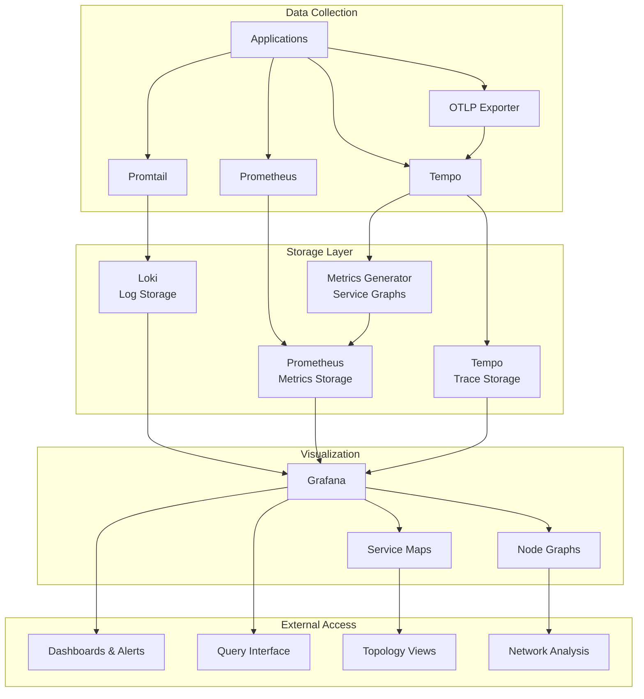

# Grafana Observability Stack

A comprehensive, production-ready observability platform implementing the **three pillars of observability**: metrics, logs, and traces. Built with Docker Compose for easy deployment and management.

## 🎯 Overview

This project offers a full-stack monitoring and observability solution using industry-standard tools from the Grafana ecosystem. It enables visibility into your applications and infrastructure via unified data collection, storage, and visualization.

### Features at a Glance

- **📊 Metrics Collection**: Scrapes and stores time-series metrics using Prometheus  
- **📝 Log Aggregation**: Collects, processes, and stores logs via Loki and Promtail  
- **🔍 Distributed Tracing**: Captures and analyzes request traces with Tempo  
- **📈 Unified Visualization**: Correlated dashboards and alerts via Grafana  
- **🔗 Data Correlation**: Links metrics, logs, and traces for end-to-end debugging  
- **🕸️ Service Graphs**: Automatic service topology visualization from traces
- **🌐 Node Graphs**: Interactive network topology views in Grafana
- **📡 OpenTelemetry Integration**: Full OTLP support with Python instrumentation library

### Key Benefits

- ✅ **Production-Ready**: Persistent storage, automatic restarts, and robust networking  
- ✅ **Zero-Config Setup**: Pre-configured data sources and dashboards  
- ✅ **Correlation-Enabled**: Trace-to-log linking and cross-source queries  
- ✅ **Scalable Architecture**: Container-based with volume persistence  
- ✅ **Environment Flexible**: Ports and credentials configurable via `.env`  
- ✅ **Service Discovery**: Automatic service topology mapping from trace data
- ✅ **Metrics from Traces**: Span metrics and service graphs generated automatically

## 🏗️ Architecture



### Component Responsibilities

| Component     | Purpose                         | Data Type                   | Port        |
|---------------|----------------------------------|-----------------------------|-------------|
| **Prometheus**| Metrics scraping and storage     | Time-series metrics         | 9090        |
| **Grafana**   | Visualization and dashboards     | All data types              | 3000        |
| **Loki**      | Log aggregation and storage      | Structured/unstructured logs| 3100        |
| **Promtail**  | Log collection agent             | Log shipping                | 9080        |
| **Tempo**     | Distributed tracing backend      | Request traces              | 3200 / 9095 |
| **OTLP**      | OpenTelemetry Protocol receiver  | Traces via gRPC/HTTP        | 4317 / 4318 |

**Note**: Loki, Tempo, and Promtail expose internal metrics to Prometheus for self-monitoring.

## 🚀 Quick Start

### Prerequisites

- **Docker** (v20.10+)
- **Docker Compose** (v2.0+)
- **4GB+ RAM** available
- **Ports available**: 3000, 3100, 3200, 4317, 4318, 9090, 9095

### 1. Clone and Setup

```bash
git clone https://github.com/Deffz-Finesse/Grafana-Observability-Stack.git
cd Grafana-Observability-Stack

# Create required directories
mkdir -p logs
```

### 2. Environment Variables

Edit the included `.env` file:

```bash
# ─── Grafana
GRAFANA_USER=admin
GRAFANA_PASSWORD=secret
GRAFANA_PORT=3000

# ─── Prometheus
PROMETHEUS_PORT=9090

# ─── Loki
LOKI_PORT=3100

# ─── Tempo
TEMPO_HTTP_PORT=3200
TEMPO_GRPC_PORT=9095
```

### 3. Launch the Stack

```bash
docker-compose up -d       # Start all services
docker-compose ps          # Verify containers
docker-compose logs -f     # View logs if needed
```

### 4. Access the Services

| Service      | URL                                              | Credentials     |
|--------------|---------------------------------------------------|-----------------|
| **Grafana**  | [http://localhost:3000](http://localhost:3000)    | admin / secret  |
| **Prometheus**| [http://localhost:9090](http://localhost:9090)   | None            |

## 📊 Usage Guide

### Accessing Grafana

1. Visit [http://localhost:3000](http://localhost:3000)
2. Login using configured credentials
3. Use pre-configured data sources:
   - Prometheus (metrics)
   - Loki (logs)
   - Tempo (traces)

### Viewing Metrics

```promql
# Example Prometheus queries
up                                  # Service health
rate(http_requests_total[5m])       # Request rate
prometheus_tsdb_head_series         # Metric count

# Service Graph Metrics (generated by Tempo)
traces_service_graph_request_total                    # Service-to-service request count
traces_service_graph_request_failed_total             # Failed requests between services
traces_service_graph_request_server_seconds           # Server-side latency
traces_service_graph_request_client_seconds           # Client-side latency

# Span Metrics (generated by Tempo)
traces_spanmetrics_latency                            # Span duration histogram
traces_spanmetrics_calls_total                        # Total span count
```

### Querying Logs

```logql
{container="app"}                    # Logs from app container
{level="error"}                      # Error-level logs
{service="api"} |= "timeout"         # API logs containing "timeout"
```

### Exploring Traces

1. Open **Explore** in Grafana  
2. Select **Tempo** as data source  
3. Search using:
   - Trace ID
   - Service name
   - Operation
   - Time range

### Service Graphs & Node Graphs

#### Service Maps
1. Navigate to **Explore** in Grafana
2. Select **Tempo** as data source
3. Click on **Service Map** tab
4. View automatic service topology generated from trace data
5. Click on service nodes to drill down into traces

#### Node Graphs
1. In any Tempo trace view, look for the **Node Graph** button
2. Interactive network topology shows:
   - Service dependencies
   - Request flow direction
   - Error rates and latencies
   - Service health indicators

#### Metrics from Service Graphs
- Service graph metrics are automatically scraped by Prometheus
- Available in Grafana dashboards for alerting and monitoring
- Provides RED metrics (Rate, Errors, Duration) per service pair

### Adding Your Applications

#### Metrics (Prometheus)

Add to `observability/prometheus/prometheus.yml`:

```yaml
scrape_configs:
  - job_name: 'your-app'
    static_configs:
      - targets: ['your-app:8080']
```

#### Traces (Tempo)

Send traces to:

- **HTTP**: `http://localhost:3200`
- **gRPC**: `http://localhost:9095`
- **OTLP gRPC**: `http://localhost:4317`
- **OTLP HTTP**: `http://localhost:4318`

#### OpenTelemetry Integration

Use the provided Python library (`lib/otel.py`) for automatic instrumentation:

```python
from lib.otel import setup_otel, get_tracer

# Initialize OpenTelemetry (call once at startup)
setup_otel()

# Get a tracer for your service
tracer = get_tracer("my-service")

# Create spans
with tracer.start_as_current_span("operation-name") as span:
    span.set_attribute("user.id", "12345")
    # Your application logic here
```

**Supported Instrumentations:**
- HTTP requests (via `requests` library)
- Database queries (SQLite, PostgreSQL)
- Redis operations
- Logging (automatic trace ID injection)

**Environment Variables:**
```bash
export OTEL_SERVICE_NAME="my-service"
export OTEL_EXPORTER_OTLP_ENDPOINT="localhost:4317"
```

## 📁 Project Structure

```
.
├── docker-compose.yml                     # Service orchestration
├── lib/
│   └── otel.py                            # OpenTelemetry Python instrumentation
├── observability/                         # Configuration files
│   ├── grafana/
│   │   └── provisioning/
│   │       ├── datasources/
│   │       │   └── datasource.yml         # Preloaded data sources (with node graphs enabled)
│   │       └── dashboards/
│   │           └── dashboard.yml          # Auto-loaded dashboards
│   ├── prometheus/
│   │   └── prometheus.yml                 # Scraping config (includes service graph metrics)
│   ├── loki/
│   │   └── loki-config.yml                # Log config
│   ├── promtail/
│   │   └── promtail-config.yml            # Log agent config
│   └── tempo/
│       └── tempo-config.yaml              # Tracing config (with metrics generator)
└── logs/                                  # Log storage (create manually)
```

## ⚙️ Configuration

### Tempo Service Graphs Configuration

The Tempo metrics generator is configured in `observability/tempo/tempo-config.yaml`:

```yaml
metrics_generator:
  storage:
    path: /tmp/tempo/generator-wal
    remote_write:
      - url: http://prometheus:9090/api/v1/write
  
  traces_storage:
    path: /tmp/tempo/generator-wal/traces
  
  registry:
    collection_interval: 15s
    external_labels:
      source: tempo

overrides:
  defaults:
    metrics_generator:
      processors: [service-graphs, span-metrics, local-blocks]
```

### Grafana Node Graph Configuration

Node graphs are enabled in `observability/grafana/provisioning/datasources/datasource.yml`:

```yaml
- name: Tempo
  type: tempo
  jsonData:
    serviceMap:
      datasourceUid: 'Prometheus'
    nodeGraph:
      enabled: true
    tracesToLogsV2:
      datasourceUid: 'Loki'
```

### Prometheus Service Graph Metrics

Service graph metrics are scraped via `observability/prometheus/prometheus.yml`:

```yaml
- job_name: 'tempo-metrics-generator'
  static_configs:
    - targets: ['tempo:3200']
  metrics_path: /metrics
```

### Retention Settings

**Prometheus** (`prometheus.yml`):

```yaml
global:
  scrape_interval: 5s
```

**Loki** (`loki-config.yml`):

```yaml
limits_config:
  retention_period: 168h  # 7 days
```

**Tempo** (`tempo-config.yaml`):

```yaml
compactor:
  retention: 48h          # 2 days
```

## 🔧 Advanced Features

### Service Graph Metrics

Tempo automatically generates service topology metrics from trace data:

- **Request Rate**: `traces_service_graph_request_total`
- **Error Rate**: `traces_service_graph_request_failed_total`  
- **Duration**: `traces_service_graph_request_server_seconds`
- **Client Latency**: `traces_service_graph_request_client_seconds`

These metrics enable:
- Service dependency mapping
- SLA monitoring and alerting
- Performance regression detection
- Capacity planning insights

### Span Metrics

Individual span performance metrics:

- **Latency Distribution**: `traces_spanmetrics_latency`
- **Call Volume**: `traces_spanmetrics_calls_total`
- **Error Tracking**: Per-operation error rates

### OpenTelemetry Features

The included Python library provides:

- **Automatic Instrumentation**: Popular libraries auto-traced
- **Manual Instrumentation**: Custom span creation and attributes
- **Context Propagation**: Distributed trace correlation
- **Resource Detection**: Service name and version tagging
- **Batch Export**: Efficient span batching to Tempo

### Correlation Features

- **Trace-to-Logs**: Click from spans to related log entries
- **Metrics-to-Traces**: Drill down from service graphs to traces
- **Service Maps**: Visual service topology from trace data
- **Exemplars**: Link from metrics to example traces

## 🚀 Production Considerations

- Use **external storage** for persistence
- Add **TLS and authentication**
- Place behind **reverse proxy** (nginx, Traefik)
- Set up **HA deployments** for redundancy
- Configure **alerts and notifications** in Grafana
- **Scale Tempo** with object storage (S3, GCS, Azure)
- **Tune metrics generator** collection intervals for performance
- **Monitor service graph cardinality** to prevent metric explosion

## 📄 License

Licensed under the MIT License. See the [LICENSE](LICENSE) file.

## 🙏 Acknowledgments

- [Grafana Labs](https://grafana.com/)
- [Prometheus](https://prometheus.io/)
- [OpenTelemetry](https://opentelemetry.io/)

## 📚 Additional Resources

- [Grafana Docs](https://grafana.com/docs/)
- [Prometheus Querying](https://prometheus.io/docs/prometheus/latest/querying/examples/)
- [Loki LogQL](https://grafana.com/docs/loki/latest/logql/)
- [Tempo Tracing Guide](https://grafana.com/docs/tempo/latest/)
- [Tempo Service Graphs](https://grafana.com/docs/tempo/latest/metrics-generator/service-graphs/)
- [OpenTelemetry Python](https://opentelemetry.io/docs/instrumentation/python/)
- [Grafana Node Graphs](https://grafana.com/docs/grafana/latest/panels/visualizations/node-graph/)

---

**⭐ Star this repository if it helped you build better observability!**
